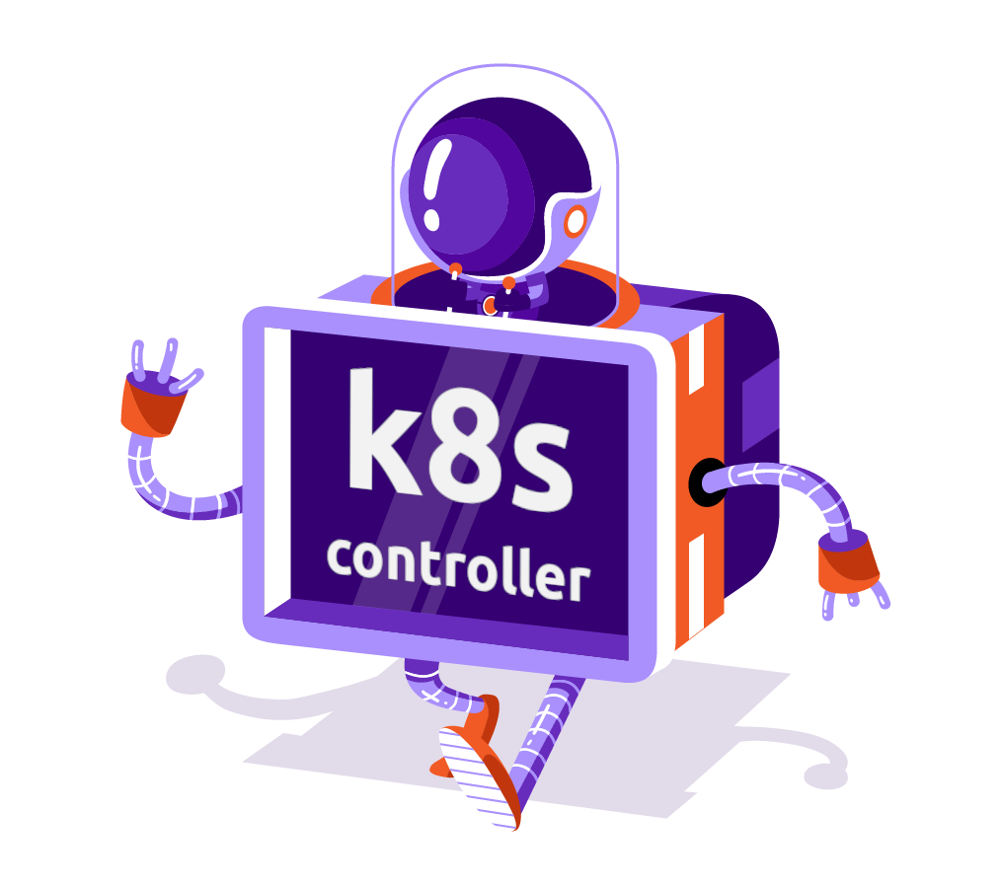

<p align="center"></p>

# scaleway-k8s-node-coffee ☕

Kubernetes toolkit controller project for Scaleway k8s nodes, that does a lot of different things based on changes in a Kubernetes cluster (especially Kapsule).

# Getting started 🚀

## Configuration

Below environment variables have to be defined in the controller container to configure it. Leaving a feature-related variable empty will disable it

| Variable             | Description                                                                                                                                                                                                                           | Example                                                                              |
| -------------------- | ------------------------------------------------------------------------------------------------------------------------------------------------------------------------------------------------------------------------------------- | ------------------------------------------------------------------------------------ |
| `KUBECONFIG`         | *optional*. `KUBECONFIG` file path to the cluster you want to run the controller against                                                                                                                                              | `~/.kube/config/my-kubeconfig.yaml`                                                  |
| `SCW_ACCESS_KEY`     | *required*. Your scaleway project access key ([docs](https://www.scaleway.com/en/docs/console/my-project/how-to/generate-api-key/))                                                                                                               | `SCWxxxxxxxxxxxxxxxxx`                                                               |
| `SCW_SECRET_KEY`     | *required*. Your scaleway project secret key ([docs](https://www.scaleway.com/en/docs/console/my-project/how-to/generate-api-key/))                                                                                                               | `11111111-1111-1111-2111-111111111111`                                               |
| `SCW_DEFAULT_REGION` | Your Scaleway DBaaS default region ([docs](https://www.scaleway.com/en/docs/compute/instances/concepts/#availability-zone), [guides](https://registry.terraform.io/providers/scaleway/scaleway/latest/docs/guides/regions_and_zones)) | `fr-par`                                                                             |
| `SCW_DEFAULT_ZONE`   | Your Scaleway DBaaS default zone ([docs](https://www.scaleway.com/en/docs/compute/instances/concepts/#availability-zone), [guides](https://registry.terraform.io/providers/scaleway/scaleway/latest/docs/guides/regions_and_zones))   | `fr-par-1`                                                                           |
| `RESERVED_IPS_POOL`  | List of already existing reserved IP, comma-separated                                                                                                                                                                                 | `51.15.15.15,51.15.15.32`                                                            |
| `REVERSE_IP_DOMAIN`  | Your desired domain name                                                                                                                                                                                                              | `example.com`                                                                        |
| `DATABASE_IDS`       | List of DBaaS IDs (with optional regional IDs), comma-separated                                                                                                                                                                       | `11111111-1111-1111-2111-111111111111,nl-ams/11111111-1111-1111-2111-111111111112`   |
| `REDIS_IDS`          | List of Redis IDs (with optional zonal IDs), comma-separated                                                                                                                                                                          | `11111111-1111-1111-2111-111111111111,nl-ams-1/11111111-1111-1111-2111-111111111112` |
| `SECURITY_GROUP_IDS` | List of security group IDs (with optional zonal IDs), comma-separated                                                                                                                                                                 | `xxxxxxxx-xxxx-xxxx-xxxx-xxxxxxxxxxxx`                                               |
| `NUMBER_RETRIES`     | *optional*. Retries on error amount (default: `30`)                                                                                                                                                                                   | `15`                                                                                 |
## Local tests

You can test it against a remote cluster by providing the corresponding `KUBECONFIG` environment variable to the container, like the following :

```bash
docker run sh4d1/scaleway-k8s-node-coffee \
  # Remote cluster to run against
  --env KUBECONFIG="~/.kube/config/my-kubeconfig.yaml" \
  ...
```

Below snippet will build and run the controller (all features enabled) locally against the given cluster (`kubeconfig`)

```bash
# Run the tests and build the image (if working on the project)
make docker-build

# Build the image
docker build -t sh4d1/scaleway-k8s-node-coffee .

# Run it with the required environment variables
docker run sh4d1/scaleway-k8s-node-coffee \
  # Remote cluster to run against
  --env KUBECONFIG="~/.kube/config/my-kubeconfig.yaml" \
  # Authentication/global configuration
  --env SCW_ACCESS_KEY="SCWxxxxxxxxxxxxxxxxx" \
  --env SCW_SECRET_KEY="11111111-1111-1111-2111-111111111111" \
  --env RETRIES_NUMBER="15" \
  # Reserved IP
  --env RESERVED_IPS_POOL="51.15.15.15,51.15.15.32" \
  # Reverse IP
  --env REVERSE_IP_DOMAIN="example.com" \
  # Database ACL
  --env SCW_DEFAULT_REGION="fr-par" \
  --env DATABASE_IDS="11111111-1111-1111-2111-111111111111,nl-ams/11111111-1111-1111-2111-111111111112" \
  # Redis ACL
  --env REDIS_IDS="11111111-1111-1111-2111-111111111111,nl-ams-1/11111111-1111-1111-2111-111111111112" \
  --env SCW_DEFAULT_ZONE="fr-par-1" \
  # Security groups
  --env SECURITY_GROUP_IDS=my-value \
```

## Deploy

Below snippet will deploy the controller on the current cluster context you're authenticated against (`kubectl config current-context`)

⚠️ Please note that you'll have to edit `./deploy/{configmap,secret}.yaml` to define your credentials and custimze your needs! 

```bash
# Using make (requires to clone the repository)
make deploy

# Using kubectl
kubectl create -f https://raw.githubusercontent.com/Sh4d1/scaleway-k8s-node-coffee/main/deploy/deploy.yaml
kubectl create -f https://raw.githubusercontent.com/Sh4d1/scaleway-k8s-node-coffee/main/deploy/secret.yaml --edit --namespace scaleway-k8s-node-coffee
kubectl create -f https://raw.githubusercontent.com/Sh4d1/scaleway-k8s-node-coffee/main/deploy/configmap.yaml --edit --namespace scaleway-k8s-node-coffee
```

### Helm

A helm implementation of this controller is in progress, feel free to contribute (https://github.com/Sh4d1/scaleway-k8s-node-coffee/pull/7)

# Features ✨

## Reserved IP

This feature allows a set of predefined reserved IP to be used as the nodes IP. Once a new node appears, it will try to assign a free reserved IP out of the given list to the node.

**Variable(s)** 📝

- `RESERVED_IPS_POOL`
  - list of already existing reserved IP, comma-separated
  - e.g. `51.15.15.15,51.15.15.32`

**Notes**

- ℹ️ A label `reserved-ip: true` will be added to the nodes with a reserved IP.

## Reverse IP

This feature allows you to set the reverse IP of the reserved IP to a custom one. It will only work if a reserved IP is already set on the node (to use with the Reserved IP feature).

**Variable(s)** 📝

- `REVERSE_IP_DOMAIN`
  - desired domain name
  - e.g. `example.com` will update the reserved IP `51.16.17.18` with the reverse `18-17-16-51.example.com`

**Notes**

- ℹ️ If your domain is hosted on Scaleway, the record such as `18-17-16-51.example.com` will be added (and removed if not needed anymore).

## Database ACLs

This feature allows to update the ACL rules of several DB to allow of all the cluster nodes (adding new ones, and removing old ones).

**Variable(s)** 📝

- `DATABASE_IDS`
  - list of DBaaS IDs (with optional regional IDs), comma-separated
  - e.g. `11111111-1111-1111-2111-111111111111,nl-ams/11111111-1111-1111-2111-111111111112`
- `SCW_DEFAULT_REGION`
  - Default DBaaS resources region
  - e.g. `fr-par`

**Notes**

- ℹ️ Will update the ACL of the database with ID `11111111-1111-1111-2111-111111111111` in the region specified by the environment variable `SCW_DEFAULT_REGION` and the database `11111111-1111-1111-2111-111111111112` in the `nl-ams` region.

- ℹ️ If your database is in a different project than the cluster nodes, please set the environment variable `NODES_IP_SOURCE` to `kubernetes`.

- ℹ️ If your DBaaS already have ACL rules allowing your k8s nodes' IPs, and not named following their IDs, you'll have to delete them or rename them with the corresponding nodes' IDs

## Redis ACLs

This feature allows to update the ACL rules of several Redis instances to allow of all the cluster nodes (adding new ones, and removing old ones).

**Variable(s)** 📝

- `REDIS_IDS`
  - list of Redis IDs (with optional zonal IDs), comma-separated
  - e.g. `11111111-1111-1111-2111-111111111111,nl-ams-1/11111111-1111-1111-2111-111111111112`
- `SCW_DEFAULT_ZONE`
  - Default Redis resources zone
  - e.g. `fr-par-1`

**Notes**

- ℹ️ Will update the ACL of the redis instance with ID `11111111-1111-1111-2111-111111111111` in the zone specified by the environment variable `SCW_DEFAULT_ZONE` and the instance `11111111-1111-1111-2111-111111111112` in the `nl-ams-1` zone.

- ℹ️ If your redis instance is in a different project than the cluster nodes, please set the environment variable `NODES_IP_SOURCE` to `kubernetes`.

## Security Group

This feature allows you to update multiple security groups with:
- The Public and Private IPs of all nodes of the cluster
- The Node Ports of the NodePort and LoadBalancer services

**Variable(s)** 📝

- `SECURITY_GROUP_IDS`
  - list of security group IDs (with optional zonal IDs), comma-separated
  - e.g. `11111111-1111-1111-2111-111111111111,nl-ams-1/11111111-1111-1111-2111-111111111112`

**Notes**

- ℹ️ However due to several lack of features, the deletion of the rules if best effort for the nodes, and non existent for the services.

## Contribution

Feel free to submit any issue, feature request or pull request :smile:!

Artwork edited, initially from [scaleway-cli](https://github.com/scaleway/scaleway-cli)